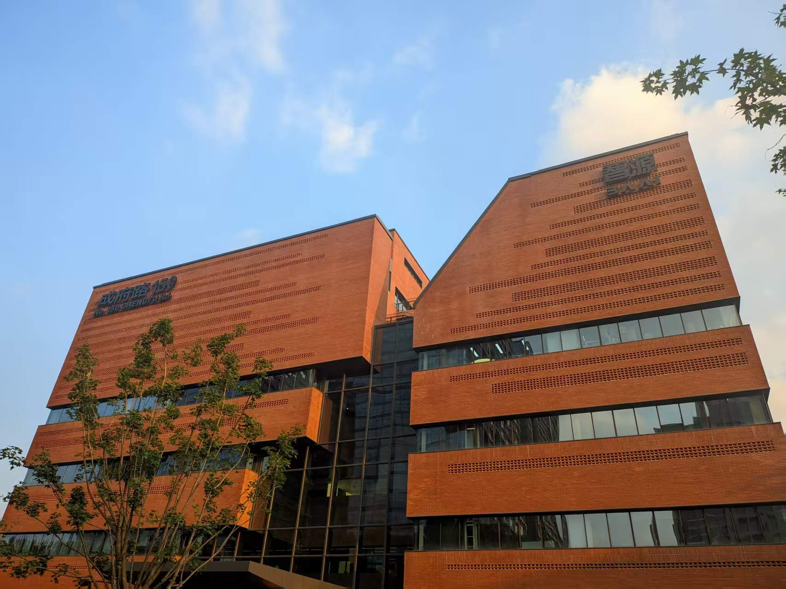
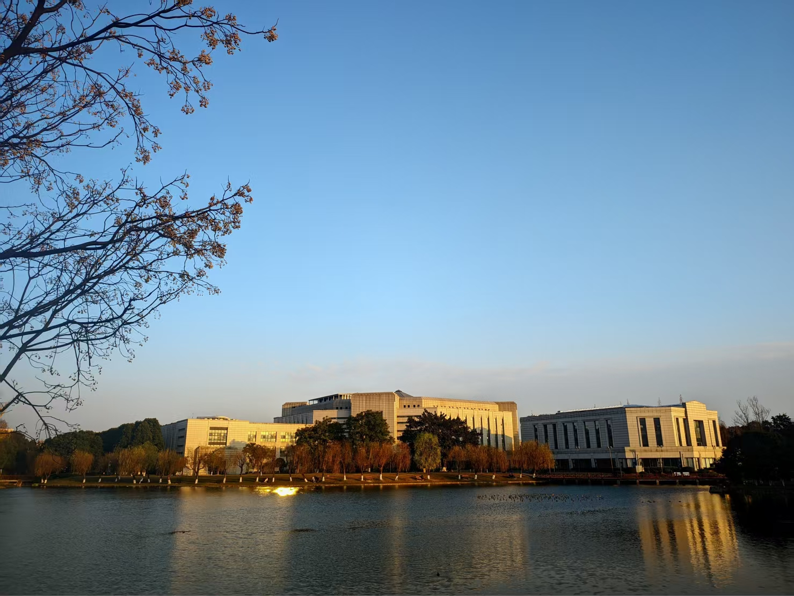

  
  ↑ This is Zhongguancun Science & Technology Park in Beijing where I interned in summer 2025 ↑

[English](./README.md) | [中文](./README_zh-CN.md)

## 👨‍🔬 About Me

Hello! I am an MS student at <b>University of Electronic Science and Technology of China</b> (UESTC).

<b>Focus:</b> Embodied Intelligence (VLA), Vision-Language Models (VLM).

  
  
  
  

---

### 📢 News

- **[Mar. 2026]** 🎉 Our **RoboCOIN** dataset has been rated as a <b style="color: #e74c3c;">EAI-100 Top-10 Dataset in 2025</b> by ModelScope and CCF TCIR!
- **[Mar. 2026]** 🖋️ I was invited to serve as a reviewer for **BMVC 2026**.
- **[Mar. 2026]** 📈 Our **RoboCOIN** dataset has reached **4,000,000+** total downloads!
- **[Feb. 2026]** 🚀 Paper **InSpire** (Intrinsic Spatial Reasoning for VLAs) accepted by **ICRA 2026**!

<b>🔍 Media Reports & Coverage</b>

- 🌏 **[ModelScope]** [BAAI RoboCOIN is officially open-sourced!](https://modelscope.csdn.net/69362ae92087ae0db79fd73a.html)
- 🌏 **[ModelScope]** [EAI-100: Top 100 Achievements & Figures in Embodied AI 2025 White Paper](https://www.modelscope.cn/learn/6060#4ever-bi-513)
- 🎙️ **[AIorang]** [RoboCOIN: Large-scale Dual-Arm Robot Dataset Public Lecture](https://www.aiorang.com/c/ODA2ODM0MDM3YjA0NjNmMDIxNjM=)
- 🏢 **[AgileX]** [BAAI builds the first large-scale multi-embodiment dual-arm data infrastructure](https://mp.weixin.qq.com/s/_McJ6izPNzD--vHhyXLgGA)
- 📰 **[Embodied AI Heart]** [PCD: Training-free & Plug-and-Play VLA for Action Prediction](https://mp.weixin.qq.com/s/DdCxn9PgkTqmbkseWyheYQ)
- 📰 **[DeepBlue]** [Simple spatial reasoning boosts VLA generalization by 4x](https://mp.weixin.qq.com/s/HJhvxMjd2uh8oZcaEVL_fA)
- 📰 **[Multimodal Space]** [CoT-enhanced spatial reasoning for VLAs](https://mp.weixin.qq.com/s/JyAuCxVBEUjm8au2e75Wng)
- 📰 **[LLMPhD]** [Skip Tuning: Lightweight adaptation for vision-language models](https://mp.weixin.qq.com/s?search_click_id=2008252490460296034-1774496722577-4783524904&__biz=MzYyMTIwMjM3MQ==&mid=2247483750&idx=1&sn=8a26c12c2c52bc289a98ef847e285fdd&chksm=fe1fc6aa7c2f9d00a1b35a36dea8599e94186d9aa013dad00a39211c9d5220e3ac99c6fc89ed&scene=7#rd)
- 📰 **[Robot Lecture Hall]** [BAAI RoboCOIN: Largest real-world dual-arm dataset with fine-grained annotations](https://mp.weixin.qq.com/s?search_click_id=15991064877490272766-1774494403679-3589861850&__biz=MzI5MzE0NDUzNQ==&mid=2247483750&idx=1&sn=3477904ab8d66b47fd4ce9b869d3a69e&chksm=f5c0a43cb86a845ef3791ae7d7de7dda717ac1c011dc8e720123f30c199b71fce22d2b910309&scene=7#rd)

---

### 💼 Experience

- 🏢 **Research Intern** · Beijing Academy of Artificial Intelligence (BAAI) · *2025.06 - Present*
- 🎓 **Master's Student** · UESTC, Computer Science · *2023.09 - Present*
  - 🏆National Scholarship (2024), 🏅Sichuan Province Outstanding Graduate (2026)
- 🎓 **Bachelor of SE** · UESTC, Software Engineering · *2019.09 - 2023.06*
  - 🏅UESTC Outstanding Graduate (2023), 🏆"Shiqiang" Special Scholarship (2022)

---

### 📕 Publications

* 🤖 **[EAI-100 TOP-10 Datasets in 2025]** **RoboCOIN: An Open-Sourced Bimanual Robotic Data Collection for Integrated Manipulation**  
  [[Project]](https://flagopen.github.io/RoboCOIN/) [[arXiv]](https://arxiv.org/abs/2511.17441) [[PDF]](https://arxiv.org/pdf/2511.17441) [[Code]](https://github.com/FlagOpen/RoboCOIN/)
    * Open-sourced large-scale bimanual robotic dataset with **15 robotic platforms** and **180K+ demonstrations**, collaborated with **20 institutions**.

* 🤖 **[ICLR 2026]** **Policy Contrastive Decoding for Robotic Foundation Models**  
  [[Project]](https://koorye.github.io/PCD) [[arXiv]](https://arxiv.org/abs/2505.13255) [[PDF]](https://arxiv.org/pdf/2505.13255) [[Code]](https://github.com/Koorye/PCD/)
    * Universal framework for multiple VLA architectures, achieving **+8%~41% improvement** without training.

* 🤖 **[ICRA 2026]** **InSpire: Vision-Language-Action Models with Intrinsic Spatial Reasoning**  
  [[Project]](https://koorye.github.io/Inspire) [[arXiv]](https://arxiv.org/abs/2412.11509) [[PDF]](https://arxiv.org/pdf/2412.11509) [[Code]](https://github.com/Koorye/Inspire/)
    * Reducing spurious correlations in VLAs, boosting performance on **seen (+6.2%)** and **unseen (+10%)** tasks.

* 🖼️ **[IJCV 2026]** **A Closer Look at Conditional Prompt Tuning for Vision-Language Models**  
  [[arXiv]](https://arxiv.org/abs/2506.23856) [[PDF]](https://arxiv.org/pdf/2506.23856) [[Code]](https://github.com/Koorye/CaPT/)
    * Identified critical issues in existing conditional prompt tuning methods, outperforming the state-of-the-art by **3.49%**.

* 🖼️ **[CVPR 2025]** **Skip Tuning: Pre-trained Vision-Language Models are Effective and Efficient Adapters**  
  [[Code]](https://github.com/Koorye/SkipTuning)
    * Parameter-free adaptation method, **+1.04%** accuracy with **15x** speedup and **6.4x** memory efficiency.

* 🖼️ **[CVPR 2024]** **DePT: Decoupled Prompt Tuning**  
[[arXiv]](https://arxiv.org/abs/2309.07439) [[PDF]](https://arxiv.org/pdf/2309.07439) [[Code]](https://github.com/Koorye/DePT/)
    * Plug-and-play method providing **+0.67%~2.65% gains** across various prompt tuning baselines.

---

### 🛠️ Technical Arsenal

| Category | Skills & Frameworks |
| :--- | :--- |
| **AI** |     |
| **Data Science** |      |
| **Languages** |     |
| **Web & Backend** |      |
| **Tools** |      |

---

### 📊 GitHub Activity

<table align="center" border="0">
  <tr>
    <td width="50%" align="center">
      
    </td>
    <td width="50%" align="center">
      
    </td>
  </tr>
</table>

  

---

### 🖼️ Gallery

<table align="center" border="0">
  <tr>
    <td width="50%" align="center">
      
      
<b>BAAI</b>

    </td>
    <td width="50%" align="center">
      
      
<b>UESTC</b>

    </td>
  </tr>
</table>