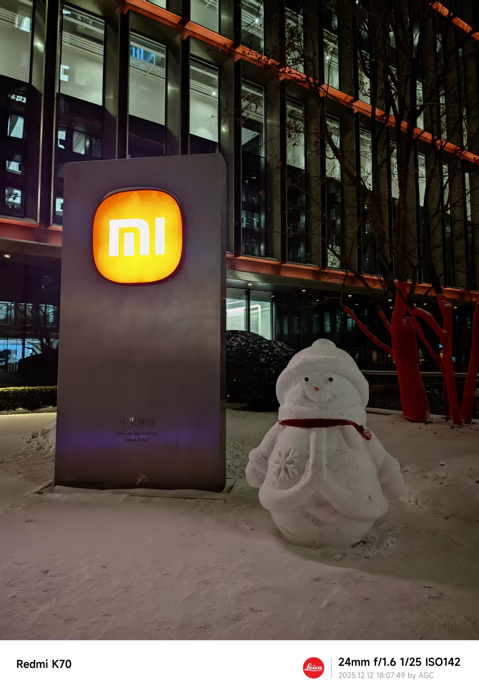
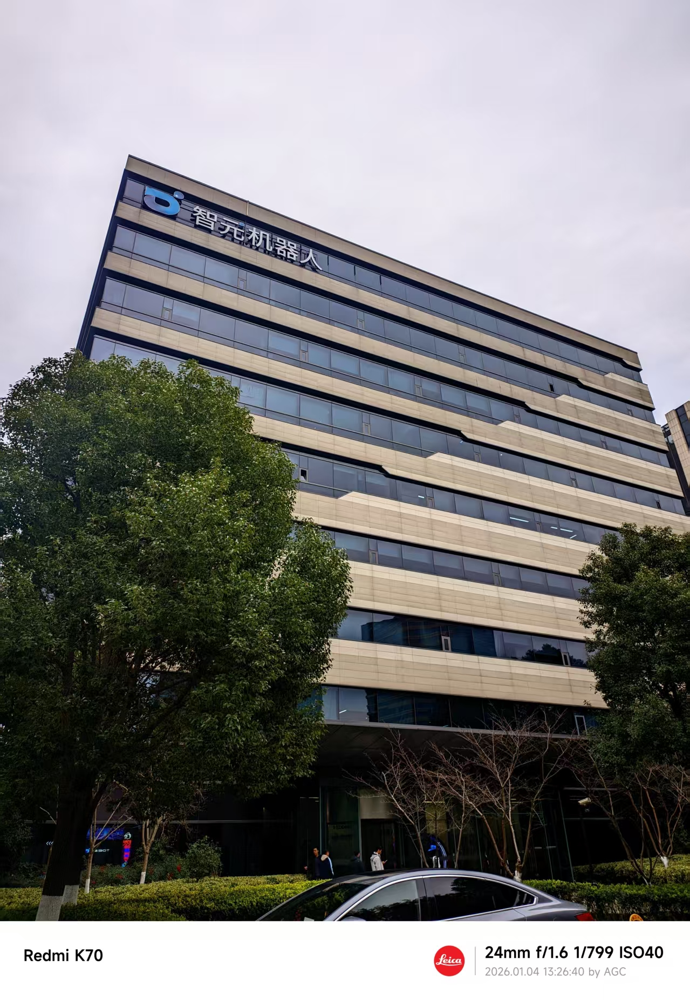
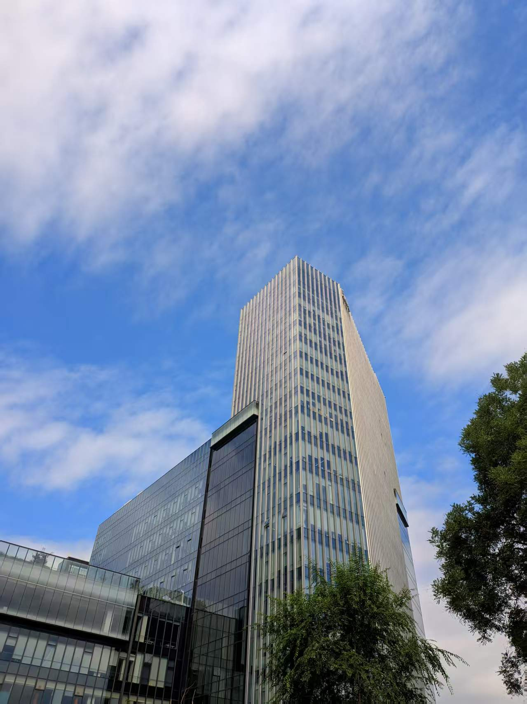
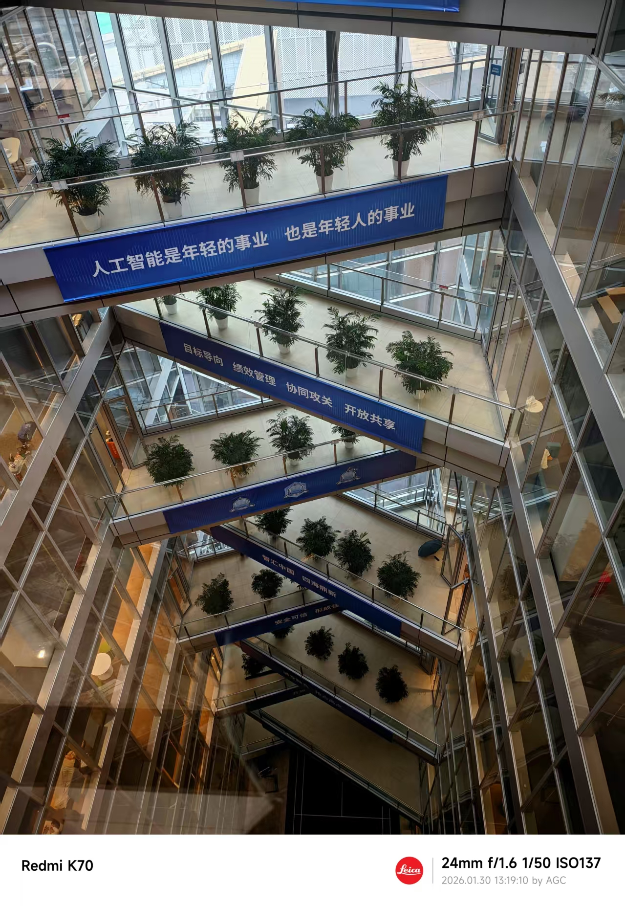

  
  ↑ 这是我在 2025 年夏天实习的北京中关村科技园 ↑

## 👨‍🔬 关于我

你好！我是<b>电子科技大学</b> (UESTC) 计算机科学与工程学院的硕士研究生。

<b>研究方向：</b> 具身智能 (VLA)、视觉语言模型 (VLM)。

  
  
  
  

---

### 📢 最新动态

- **[2026.03]** 🎉 我们的 **RoboCOIN** 数据集入选 ModelScope 与 CCF TCIR 评选的 <b style="color: #e74c3c;">EAI-100 2025 年度十大数据集</b>！
- **[2026.03]** 🖋️ 受邀担任 **BMVC 2026** 审稿人。
- **[2026.03]** 📈 **RoboCOIN** 数据集累计下载量已突破 **4,000,000** 次！
- **[2026.02]** 🚀 论文 **InSpire** (关于 VLA 内在空间推理的研究) 被 **ICRA 2026** 接收！

<b>🔍 媒体报道与专题</b>

- 🌏 **[魔搭社区]** [智源 RoboCOIN 数据集正式开源！](https://modelscope.csdn.net/69362ae92087ae0db79fd73a.html)
- 🌏 **[魔搭社区]** [EAI-100: 2025 具身智能白皮书百强成果与人物入选](https://www.modelscope.cn/learn/6060#4ever-bi-513)
- 🎙️ **[将门创投]** [RoboCOIN: 用于统一操控的大规模双臂机器人数据集 | 公开课](https://www.aiorang.com/c/ODA2ODM0MDM3YjA0NjNmMDIxNjM=)
- 🏢 **[松灵机器人]** [智源研究院构建首个大规模多具身双臂操控数据基础设施](https://mp.weixin.qq.com/s/_McJ6izPNzD--vHhyXLgGA)
- 📰 **[具身智能之心]** [PCD: 无需训练、即插即用的 VLA，消除动作预测中的伪相关](https://mp.weixin.qq.com/s/DdCxn9PgkTqmbkseWyheYQ)
- 📰 **[深蓝学院]** [打破 VLA 伪相关！简单的空间推理让泛化能力提升 4 倍](https://mp.weixin.qq.com/s/HJhvxMjd2uh8oZcaEVL_fA)
- 📰 **[多模态空间]** [思维链增强的空间推理，助力 VLA 连接高维空间](https://mp.weixin.qq.com/s/JyAuCxVBEUjm8au2e75Wng)
- 📰 **[硕博心理]** [成电 & 同济 Skip Tuning: 视觉语言模型的轻量化适配方案](https://mp.weixin.qq.com/s?search_click_id=2008252490460296034-1774496722577-4783524904&__biz=MzYyMTIwMjM3MQ==&mid=2247483750&idx=1&sn=8a26c12c2c52bc289a98ef847e285fdd&chksm=fe1fc6aa7c2f9d00a1b35a36dea8599e94186d9aa013dad00a39211c9d5220e3ac99c6fc89ed&scene=7#rd)
- 📰 **[机器人大讲堂]** [智源 RoboCOIN: 带有细粒度标注的最大规模真实世界双臂数据集](https://mp.weixin.qq.com/s?search_click_id=15991064877490272766-1774494403679-3589861850&__biz=MzI5MzE0NDUzNQ==&mid=2247483750&idx=1&sn=3477904ab8d66b47fd4ce9b869d3a69e&chksm=f5c0a43cb86a845ef3791ae7d7de7dda717ac1c011dc8e720123f30c199b71fce22d2b910309&scene=7#rd)

---

### 💼 个人经历

- 🏢 **研究实习生** · 北京智源人工智能研究院 (BAAI) · *2025.06 - 至今*
- 🎓 **硕士研究生** · 电子科技大学，计算机科学与技术 · *2023.09 - 至今*
  - 🏆国家奖学金（2024），🏅四川省优秀毕业生（2026）
- 🎓 **工学学士** · 电子科技大学，软件工程 · *2019.09 - 2023.06*
  - 🏅电子科技大学优秀毕业生（2023），🏆“世强”专项奖学金（2022）
---

### 📕 发表论文

* 🤖 **[EAI-100 2025年度 TOP-10 数据集]** **RoboCOIN: An Open-Sourced Bimanual Robotic Data Collection for Integrated Manipulation**  
  [[项目主页]](https://flagopen.github.io/RoboCOIN/) [[arXiv]](https://arxiv.org/abs/2511.17441) [[PDF]](https://arxiv.org/pdf/2511.17441) [[代码]](https://github.com/FlagOpen/RoboCOIN/) 
    * 开源大规模双臂机器人数据集，涵盖 **15 个机器人平台** 和 **18万+ 条演示数据**，由 **20 家机构** 联合协作完成。

* 🤖 **[ICLR 2026]** **Policy Contrastive Decoding for Robotic Foundation Models**  
  [[项目主页]](https://koorye.github.io/PCD) [[arXiv]](https://arxiv.org/abs/2505.13255) [[PDF]](https://arxiv.org/pdf/2505.13255) [[代码]](https://github.com/Koorye/PCD/) 
    * 适用于多种 VLA 架构的通用框架，在无需训练的情况下实现 **+8%~41%** 的性能提升。

* 🤖 **[ICRA 2026]** **InSpire: Vision-Language-Action Models with Intrinsic Spatial Reasoning**  
  [[项目主页]](https://koorye.github.io/Inspire) [[arXiv]](https://arxiv.org/abs/2412.11509) [[PDF]](https://arxiv.org/pdf/2412.11509) [[代码]](https://github.com/Koorye/Inspire/) 
    * 减少 VLA 模型中的虚假相关性，显著提升模型在 **已见任务 (+6.2%)** 和 **未见任务 (+10%)** 中的空间推理能力。

* 🖼️ **[IJCV 2026]** **A Closer Look at Conditional Prompt Tuning for Vision-Language Models**  
  [[arXiv]](https://arxiv.org/abs/2506.23856) [[PDF]](https://arxiv.org/pdf/2506.23856) [[代码]](https://github.com/Koorye/CaPT/) 
    * 揭示了现有条件提示微调（Conditional Prompt Tuning）方法中的关键问题，性能超越当前 SOTA 方法 **3.49%**。

* 🖼️ **[CVPR 2025]** **Skip Tuning: Pre-trained Vision-Language Models are Effective and Efficient Adapters**  
  [[arXiv](https://arxiv.org/abs/2412.11509)][[PDF](https://arxiv.org/pdf/2412.11509)][[代码]](https://github.com/Koorye/SkipTuning) 
    * 一种无参数适配方法，在提升 **1.04%** 准确率的同时，实现 **15倍** 的推理加速和 **6.4倍** 的显存效率提升。

* 🖼️ **[CVPR 2024]** **DePT: Decoupled Prompt Tuning**  
  [[arXiv]](https://arxiv.org/abs/2309.07439) [[PDF]](https://arxiv.org/pdf/2309.07439) [[代码]](https://github.com/Koorye/DePT/) 
    * 即插即用的解耦提示微调方法，在多个提示微调基准模型上稳定提供 **+0.67%~2.65%** 的性能增益。

---

### 🛠️ 技术栈

| 分类 | 技能与框架 |
| :--- | :--- |
| **人工智能** |     |
| **数据科学** |      |
| **编程语言** |     |
| **Web 与后端** |      |
| **常用工具** |      |

---

### 📊 GitHub 活跃度

<table align="center" border="0">
  <tr>
    <td width="50%" align="center">
      
    </td>
    <td width="50%" align="center">
      
    </td>
  </tr>
</table>

  

---

### 🖼️ 相册

<table align="center" border="0">
  <tr>
    <td width="50%" align="center">
      
      
<b>北京智源人工智能研究院实习</b>

    </td>
    <td width="50%" align="center">
      
      
<b>电子科技大学</b>

    </td>
  </tr>
</table>
<table>
  <tr>
    <td width="25%" align="center">
      
      
小米顶尖应届交流会

    </td>
    <td width="25%" align="center">
      
      
智元机器人优才计划参观行

    </td>
    <td width="25%" align="center">
      
      
参观银河通用机器人公司

    </td>
    <td width="25%" align="center">
      
      
上海人工智能实验室人才交流会

    </td>
  </tr>
</table>